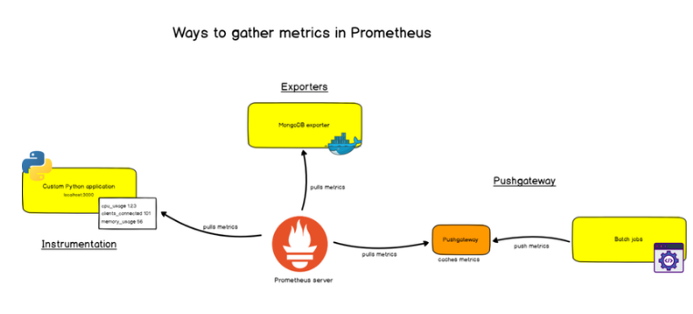
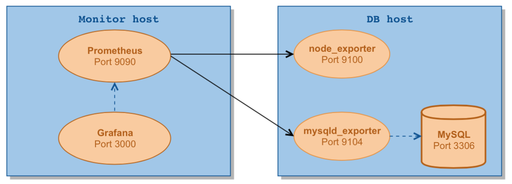

# TÌM HIỂU PROMETHEUS & GRAFANA 
### ***Mục lục***

[1.	Sơ lược về PROMETHEUS ?](#1) 

[2. Sơ lược về GRAFANA ?](#2)

[3. Tham khảo](#3)
<a name = '1'></a>
## 1. Sơ lược về PROMETHEUS ?


- Một trong số các công cụ hữu ích mà mình sử dụng cho việc monitoring servers đó là Prometheus - An Opensource Time Series Database. 
Bài viết này dành cho các bạn đang tìm hiểu về Prometheus, với mục đích giúp các bạn nhanh chóng hiểu về cách mà Prometheus hoạt động,
cách cài đặt và cấu hình prometheus trước khi biến các số liệu (metrics) thành những thứ ảo diệu hơn. Bây giờ hãy cùng mình tìm hiểu về nó nhé!

- Cách hoạt động của prometheus:
  - Prometheus sẽ chủ động pull (kéo) các metrics về qua HTTP mỗi 10s hay 30s do chúng ta thiết lập. 
  Bản thân các service thì thường không thể tự export được các metrics cho Prometheus mà cần đến các Instructmentation/Exporter. 
  Hai khái niệm này đều chung mục đích, nhưng có thể tạm hiểu như sau:
    - Exporter là những app được viết cho mấy cái thông dụng như Database, Server. Chúng ta chỉ cần chạy nó và nó sẽ export các metrics thu thập được cho mình.
    - Instructmentation thì ám chỉ nhưng client-libraries được cung cấp bởi Prometheus hoặc một bên thứ 3 nào đó, để mình cài vào ứng dụng của mình, giúp tùy biến những metrics riêng của hệ thống. Kiểu như số lượng người đã login vào website của mình từng giờ chẳng hạn.
    
    
  - Một số exporter:
    - Prometheus: chính bản thân prometheus cũng có một built-in exporter, export các metrics về service prometheus ra tại URI: http://prometheus.lc:9090/metrics.
    - cAdvisor: export các metrics của các docker service, các process trên server.
    - Node Exporter: export các metrics một con node (hiểu là một server) như CPU, RAM của node, dung lượng ổ đĩa, số lượng request tới node đấy, .etc.
    - Postgres Exporter, giúp đọc dữ liệu từ các bảng trong Postgres và export ra cho Prometheus.
    - HAProxy Exporter.
- Trong một bài viết mình tham khảo cũng có so sánh cách hoạt động của Prometheus vs InfluxDB. Theo đó thì Prometheus chủ động tạo request tới các exporter để lấy dữ liệu về trong khi InfluxDB thì ở thế bị động, là các "exporter" sẽ đẩy dữ liệu tới InfluxDB.

<a name = '2'></a>
## 2. Sơ lược về GRAFANA ?
- Grafana là một giao diện/dashboard theo dõi hệ thống (opensource), hỗ trợ rất nhiều loại dashboard và các loại graph khác nhau để người quản trị dễ dàng theo dõi.
- Grafana có thể truy xuất dữ liệu từ Graphite, Elasticsearch, OpenTSDB, Prometheus và InfluxDB. Grafana là một công cụ mạnh mẽ để truy xuất và biểu diễn dữ liệu dưới dạng các đồ thị và biểu đồ.


## 3. Tham Khảo ?


````
make by GEn
````
