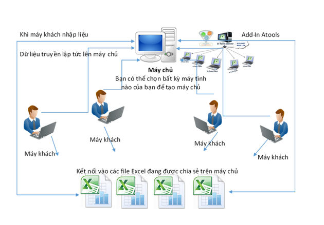

## TÌM HIỂU SAMBA SERVER
### ***Mục lục***

[1.	Sơ lược về SambaServer ?](#1) 
- [1.1.	SambaServer là gì ?](#1.1)
- [1.2. Ưu và nhược điểm của SambaServer ?](#1.2)
  - [Ưu điểm :](#1.2.1)
  - [Nhược điểm:](#1.2.2)
  
[2. Tìm hiểu giao thức SMB ?](#2)
- [2.1.	SMB là gì ?](#2.1)
- [2.2. Các tính năng SMB ?](#2.2)

[3. Tham khảo](#3)

## 1. Sơ lược về Sambaserver ?

### 1.1.	SambaServer là gì ?
- Và máy chủ Samba được phát triển như thế nào? Máy chủ Samba được xem là một Máy chủ tập tin (File Server), sử dụng trong mạng nội bộ. 
Là nơi lưu trữ tập trung các thông tin của một tổ chức, doanh nghiệp bất kỳ và thường được cài đặt trên hệ điều hành Linux hoặc Windows. 
Máy chủ Samba hoạt động chủ yếu dựa trên giao thức SMB (Server Message Block Protocol) được công bố năm 1984 trong một tài liệu kỹ thuật của hãng IBM với mục đích ban đầu là thiết kế một giao thức mạng để đặt tên và duyệt (naming and browsing).

### 1.2.	Ưu và nhược điểm của SambaServer ?
  
   ### 1.2.1. Ưu điểm :
   - Miễn phí và mã nguồn mở * Di động trên nhiều nền tảng * Cho phép kết nối các máy trạm Windows với các máy tính chạy các nền tảng khác dễ dàng hơn.
   
   ### 1.2.2. Nhược điểm :
   -  SMB vẫn đang phát triển, do đó việc duy trì khả năng tương thích với việc triển khai của Microsoft là một cuộc chiến không ngừng. Mối đe dọa của hành động pháp lý đối với người dùng thương mại Samba từ Microsoft.

## 2. Tìm hiểu giao thức SMB ?

### 2.1 SMB là gì ?
- Đối với giao thức SMB (tên gọi sơ khai của CIFS), nó hoạt động trong mạng Internet dựa trên giao thức TCP/IP. 
Và đem đến cho người dùng toàn quyền trong việc tạo một tập tin với các quyền hạn như Chỉ đọc (Read Only), Đọc và ghi (Read-Write), đặt mật khẩu, khóa một tập tin,…. 
  
  

### 2.2 Các tính năng SMB :
  - Đàm phán, dàn xếp để tương thích giữa các hình thái SMB.
  - Phát hiện các máy chủ sử dụng SMB trên mạng (browse network).
  - Xác thực truy cập file, thư mục chia sẻ.
  - Thông báo sự thay đổi file và thư mục.
  - Xử lý các thuộc tính mở rộng của file.
  - Hỗ trợ Unicode.
  
  ## 3. Tham khảo :
  - [totolink.vn](https://www.totolink.vn/article/138-samba-server-la-gi-tong-quan-ve-giao-thuc-smb.html)
