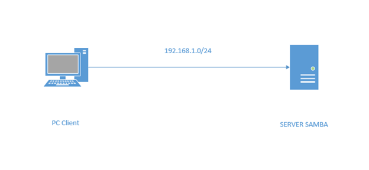

# SETUP SAMBA SERVER CESTOS 7

### ***Mục lục***

[1.	Mô hình và chuẩn bị](#1)

[2.	Cấu hình Samba](#2)

- [2.1.	Samba Server](#2.1)

- [2.2.	Samba Client](#2.2)

- [2.3.	Setup Samba Server](#2.3)

  - [2.3.1. Cấu hình chia sẻ ẩn danh truy cập](#2.3.1)
  - [2.3.2. Kiểm tra cấu hình samba server.](#2.3.2)
  - [2.3.3. Setup firewall](#2.3.3)
  - [2.3.4. Setup SELinux ](#2.3.4)

- [2.4. Test Samba Share](#2.4)

[3. Tham khảo](#3)

<a name = '1'></a>
# 1. Mô hình và chuẩn bị


<a name = '2'></a>
# 2. Cấu hình Samba
<a name = '2.1'></a>

## 2.1. Samba Server
```
Operating system : CentOS 7 minimal server
Hostname : server.unixmen.local
IP Address : 192.168.1.101/24
```

<a name = '2.2'></a>
## 2.2. Samba Client
```
Operating system : Windows 7 Professional
Hostname : client
IP Address : 192.168.1.102/24
```
<a name = '2.3'></a>
## 2.3. Setup Samba Server
- Kiểm tra gói samba hiện có nếu có sử dụng các lệnh sau.
```
rpm -qa | grep samba
yum list installed | grep samba
```
- Nếu samba được cài đặt, loại bỏ nó bằng lệnh dưới đây:
```
yum remove samba*
```
- Bây giờ, cài đặt samba bằng lệnh sau.
```
yum install samba* -y
```
<a name = '2.3.1'></a>
### 2.3.1. Cấu hình chia sẻ ẩn danh truy cập
- Bây giờ, hãy để chúng ta tạo một chia sẻ ẩn danh truy cập đầy đủ cho người dùng. Bất kỳ ai cũng có thể đọc / viết trong chia sẻ này.
- Tạo một thư mục có tên ***‘/samba/anonymous_share’*** và đặt toàn quyền. Bạn có thể đặt tên cho chia sẻ này theo ý thích của bạn.
```
mkdir -p /samba/anonymous_share
chmod -R 0777 /samba/anonymous_share
```
- Chỉnh sửa tập tin cấu hình Samba;
```
vi /etc/samba/smb.conf
```
- Tìm các chỉ mục sau mà chỉnh sửa như bên dưới:
```
[...]

## Add the following lines under [global] section ##
unix charset = UTF-8
dos charset = CP932

## Change the to windows default workgroup ##
workgroup = WORKGROUP

## Uncomment and set the IP Range ##
hosts allow = 127. 192.168.1.

## Uncomment ##
max protocol = SMB2

## Uncomment, and change the value of 'Security' to 'user' ## 
security = user

## Add the following line ##
map to guest = Bad User

## Add the following lines at the bottom ##
[Anonymous share]
path = /samba/anonymous_share
writable = yes
browsable = yes
guest ok = yes
guest only = yes
create mode = 0777
directory mode = 0777
```

- Start samba 
```
systemctl start smb
systemctl start nmb
systemctl enable smb
systemctl enable nmb
```

<a name = '2.3.2'></a>
### 2.3.2. Kiểm tra cấu hình samba server.
- Test với câu lệnh sau:
```
testparm
```
- Ta thấy output như sau:
```
Load smb config files from /etc/samba/smb.conf
rlimit_max: increasing rlimit_max (1024) to minimum Windows limit (16384)
Processing section "[homes]"
Processing section "[printers]"
Processing section "[Anonymous share]"
Loaded services file OK.
WARNING: You have some share names that are longer than 12 characters.
These may not be accessible to some older clients.
(Eg. Windows9x, WindowsMe, and smbclient prior to Samba 3.0.)
Server role: ROLE_STANDALONE
Press enter to see a dump of your service definitions

[global]
    dos charset = CP932
    netbios name = UNIXMEN SAMBA SERVER
    server string = Samba Server Version %v
    map to guest = Bad User
    log file = /var/log/samba/log.%m
    max log size = 50
    server max protocol = SMB2
    idmap config * : backend = tdb
    hosts allow = 127., 192.168.1.
    cups options = raw

[homes]
    comment = Home Directories
    read only = No
    browseable = No

[printers]
    comment = All Printers
    path = /var/spool/samba
    printable = Yes
    print ok = Yes
    browseable = No

[Anonymous share]
    path = /samba/anonymous_share
    read only = No
    create mask = 0777
    directory mask = 0777
    guest only = Yes
    guest ok = Yes
```

<a name = '2.3.3'></a>
### 2.3.3. Setup firewall
- Cho phép các cổng mặc định của máy chủ Samba thông qua tường lửa.
```
firewall-cmd --permanent --add-port=137/tcp
firewall-cmd --permanent --add-port=138/tcp
firewall-cmd --permanent --add-port=139/tcp
firewall-cmd --permanent --add-port=445/tcp
firewall-cmd --permanent --add-port=901/tcp
```
- Ta reload lại firewall
```
firewall-cmd --reload
```

<a name = '2.3.4'></a>
### 2.3.4. Setup SELinux
- Bật ***Bamba samba_enable_home_dirs*** nếu bạn muốn chia sẻ thư mục home qua Samba.
```
setsebool -P samba_enable_home_dirs trên
```
*Nếu bạn tạo một thư mục mới, chẳng hạn như thư mục cấp cao mới, hãy gắn nhãn đó với samba_share_t để SELinux cho phép Samba đọc và ghi vào thư mục đó. Không gắn nhãn các thư mục hệ thống, chẳng hạn như / etc / và / home / , với samba_share_t, vì các thư mục đó đã có nhãn SELinux.*
- Trong trường hợp của tôi, tôi đã tạo một thư mục ẩn danh *anonymou*. Vì vậy, hãy để chúng tôi dán nhãn như hình dưới đây.
```
chcon -t samba_share_t /samba/anonymous_share/
```
**Nếu bạn không muốn gây lỗi với SElinux thì hãy disabled nó đi bằng lệnh sau, trước tiên mở m**

```
vi /etc/sysconfig/selinux
```
**Thay đổi enabled > disabled **
- Như thế này:
```
# This file controls the state of SELinux on the system.
# SELINUX= can take one of these three values:
# enforcing - SELinux security policy is enforced.
# permissive - SELinux prints warnings instead of enforcing.
# disabled - No SELinux policy is loaded.
SELINUX=disabled
# SELINUXTYPE= can take one of these two values:
# targeted - Targeted processes are protected,
# mls - Multi Level Security protection.
SELINUXTYPE=targeted
```
- Khởi động lại server 

<a name = '2.4'></a>
## 2.4. Test Samba Share


<a name = '3'></a>
# 3. Tham Khảo
