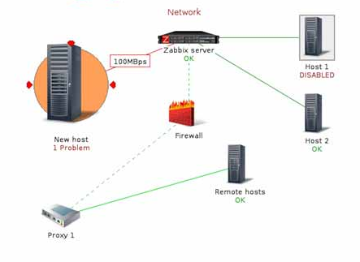

# TÌM HIỂU SƠ LƯỢC ZABBIX 
### ***Mục lục***

[1.	Sơ lược về Zabbix ?](#1) 
- [1.1.	Zabbix là gì ?](#1.1)
- [1.2. Ưu và nhược điểm của Zabbix ?](#1.2)
  - [Ưu điểm :](#1.2.1)
  - [Nhược điểm:](#1.2.2)
- [1.3. Yêu cầu về phần cứng?](#1.3)

[2. Các thành phần của hệ thống giảm sát Zabbix ?](#2)
- [2.1.	Zabbix Server:](#2.1)
- [2.2. Zabbix Proxy:](#2.2)
- [2.3. Zabbix Agent:](#2.3)
- [2.4. Giao diện web:](#2.4)

[3. Tham khảo](#3)
## 1. Sơ lược về Zabbix ?

### 1.1.	Zabbix là gì ?

- Zabbix là một giải pháp giám sát dịch vụ hệ thống mạng phân tán mã nguồn mở nổi tiếng, có nhiều tính năng độc đáo và khả năng tùy biến cao. Zabbix có khả năng phục vụ cho hệ thống mạng tầm trung và lớn của các doanh nghiệp hiện tại với mức chi phí đầu tư vừa phải.
- Zabbix được sáng lập bởi Alexei Vladishev và hiện tại được phát triển cũng như hỗ trợ bởi tổ chức Zabbix SIA. Zabbix được viết và phát hành dưới bản quyền General Public License GPL phiên bản 2. Zabbix sử dụng các cơ chế thông báo vấn đề linh hoạt cho quản trị viên như email, sms, OTT App,.. Zabbix cũng cung cấp báo cáo và dữ liệu cực kì chính xác dựa trên cơ sở dữ liệu đã thu thập được từ thiết bị mạng.
- Tất cả báo cáo, thống kê cũng như cấu hình thông số của Zabbix có thể dễ dàng truy cập qua giao diện web tinh tế đẹp mắt. Giúp chúng ta theo dõi được tình trạng hệ thống thiết bị server, dịch vụ,..

### 1.2. Ưu và nhược điểm của Zabbix ?
  
   ### 1.2.1. Ưu điểm :
   - Zabbix có các ưu điểm sau mà bạn không nên bỏ qua :

    - Tự động tìm phát hiện server và hệ thống mạng
    - Hỗ trợ server cài đặt trên dòng hệ điều hành Unix/Linux.
    - Hỗ trợ máy trạm client nhiều hệ điều hành.
    - Giao diện web cực kì tinh tế và đẹp mắt.
    - Có thông báo sự cố qua email hoặc OTP App.
    - Có báo cáo, biểu đồ qua giao diện web đẹp mắt.
    - Kiểm tra theo dõi việc đăng nhập.
    - Linh động trong việc phân quyền người sử dụng.
    - Mã nguồn mở, chi phí đầu tư thấp.
    - Nhiều plugin hỗ trợ cho các dịch vụ hệ thống khác nhau.
  
   ### 1.2.2. Nhược điểm :
    - Không có giao diện web mobile hỗ trợ.
    - Không phù hợp với hệ thống mạng lớn hơn 1000+ node thiết bị client cần giám sát. Lúc này phát sinh vấn đề hiệu suất về PHP và Database.
    - Thiết kế template/alerting rule đôi khi khá phức tạp.

### 1.3. Yêu cầu phần cứng ?
- Tuỳ theo số lượng máy chủ hoặc thiết bị mạng cần giám sát mà ta sẽ có các mức cấu hình phần cứng phù hợp cho dịch vụ Zabbix Server. Theo cá nhân mình thì phần cứng tối thiểu sẽ gồm :

      CPU : 2 core
      RAM : 1GB
      Disk : 50GB
     
## 2. Các thành phần của hệ thống giảm sát Zabbix ?

### 2.1. Zabbix Server:
- Đây là ứng dụng chương trình dịch vụ chính của dịch vụ Zabbix. Zabbix Server sẽ chịu trách nhiệm cho các hoạt động kiểm tra dịch vụ mạng từ xa, thu thập thông tin, lưu trữ, hiển thị, cảnh báo,… từ đó các quản trị viên có thể thao tác giám sát hệ thống tốt nhất.

### 2.2. Zabbix Proxy:
- Là một máy chủ được dùng cho việc quản lý nhiều nhánh hệ thống ở xa, hoặc ở các lớp mạng khác nhau. Từ Zabbix Proxy sẽ thu thập các thông tin thiết bị mạng rồi chuyển tiếp về cho máy chủ dịch vụ chính Zabbix Server.

### 2.3. Zabbix Agent:
- Zabbix agent là chương trình zabbix dùng để cài đặt lên các máy chủ hoặc thiết bị phía client. Từ đó hỗ trợ kết nối từ Zabbix Server để lấy các thông tin cần thiết từ client nhằm kiểm tra các tình trạng hệ thống hoặc theo nhu cầu quản trị viên.

### 2.4. Giao diện web:
- Cung cấp giao diện web trên nền tảng mã nguồn PHP cùng phong cách metro tinh tế. Hiện tại có thể xem Zabbix là một trong những ứng dụng có giao diện đẹp nhất, thiết kế vị trí tính năng bắt mắt và hợp lý.
